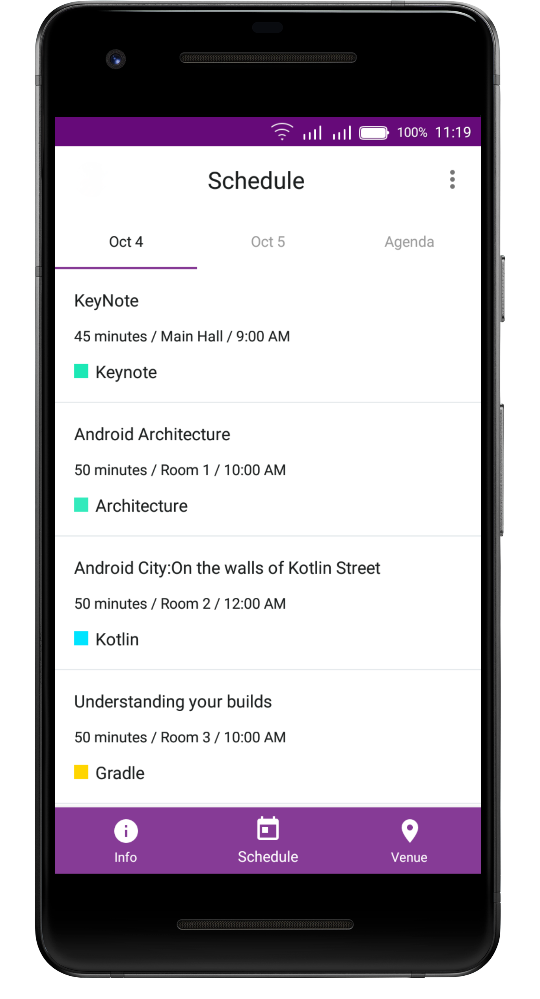

# droidconKE Android App


Android app for the first ever Android Developer conference-droidcon in Nairobi 2018

This project is the Android app for the conference. The app supports devices
running Android 5.0+, and is optimized for phones and tablets of all shapes
and sizes.

# Source

The source code in this repository reflects the app as of droidconKE 2018.

# Features

The app displays a list of conference events - sessions, office hours, app
reviews, codelabs, etc. -  Users can see details about
events, and they can star events that interest them. 

The app also displays a map of the venue and shows informational pages to guide
attendees during the conference.

<div>
  
</div>

# Development Environment

The app is written  in Java and Kotlin and uses the Gradle build system.

To build the app, use the `gradlew build` command or use "Import Project" in
Android Studio. A canary or stable version >= 3.2 of Android Studio is
required and may be downloaded
[here](https://developer.android.com/studio/archive).

# Architecture

The architecture is built around
[Android Architecture Components](https://developer.android.com/topic/libraries/architecture/).

We followed the recommendations laid out in the
[Guide to App Architecture](https://developer.android.com/jetpack/docs/guide)
when deciding on the architecture for the app. We kept logic away from
Activities and Fragments and moved it to
[ViewModel](https://developer.android.com/topic/libraries/architecture/viewmodel)s.
We observed data using
[LiveData](https://developer.android.com/topic/libraries/architecture/livedata)


We used a Repository layer for handling data operations.droidconKE's data comes
from a few different sources -  user data is stored in
[Cloud Firestore](https://firebase.google.com/docs/firestore/)
(either remotely or in
a local cache for offline use), user preferences and settings are stored in
SharedPreferences, conference data is stored remotely and is fetched and stored
in memory for the app to use, etc. - and the repository modules
are responsible for handling all data operations and abstracting the data sources
from the rest of the app (we liked using Firestore, but if we wanted to swap it
out for a different data source in the future, our architecture allows us to do
so in a clean way).

## Firebase

The app makes considerable use of the following Firebase components:

-  [Cloud Firestore](https://firebase.google.com/docs/firestore/) is our source
for all conference and user data. Firestore gave us automatic sync  and also 
seamlessly managed offline functionality for us.
- [Crashlytics](https://firebase.google.com/docs/crashlytics/)
allowed us to detect bugs and catch errors.
- [Firebase Cloud Messaging](https://firebase.google.com/docs/cloud-messaging/concept-options)
let us inform the app about changes to conference data on our server.
- [Remote Config](https://firebase.google.com/docs/remote-config/) helped us
manage in-app constants.
- [Firebase Authentification](https://firebase.google.com/docs/auth/) helped us 
to provide easy and secure authentification using email.

# \[ 🚧 Work in progress 👷‍♀️⛏👷🔧️ 🚧 \]

* Migrating to AndroidX
* Rewriting .droidconKE app in Kotlin and taking advantage of kotlin features like coroutines,kotlin android extensions etc
* Version 2.0 features writeup(UI Improvements, Event Reservation Feature,Starring Session Feature etc) 
* CI/CD Setup
* Offline First Architecture Improvements


### License

```
MIT License

Copyright (c) 2018 droidConKE

Permission is hereby granted, free of charge, to any person obtaining a copy
of this software and associated documentation files (the "Software"), to deal
in the Software without restriction, including without limitation the rights
to use, copy, modify, merge, publish, distribute, sublicense, and/or sell
copies of the Software, and to permit persons to whom the Software is
furnished to do so, subject to the following conditions:

The above copyright notice and this permission notice shall be included in all
copies or substantial portions of the Software.

THE SOFTWARE IS PROVIDED "AS IS", WITHOUT WARRANTY OF ANY KIND, EXPRESS OR
IMPLIED, INCLUDING BUT NOT LIMITED TO THE WARRANTIES OF MERCHANTABILITY,
FITNESS FOR A PARTICULAR PURPOSE AND NONINFRINGEMENT. IN NO EVENT SHALL THE
AUTHORS OR COPYRIGHT HOLDERS BE LIABLE FOR ANY CLAIM, DAMAGES OR OTHER
LIABILITY, WHETHER IN AN ACTION OF CONTRACT, TORT OR OTHERWISE, ARISING FROM,
OUT OF OR IN CONNECTION WITH THE SOFTWARE OR THE USE OR OTHER DEALINGS IN THE
SOFTWARE.

```

